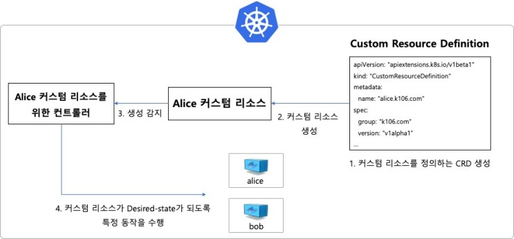

# 12. 커스텀 리소스와 컨트롤러
- 포드, 디플로이먼트, 서비스 등은 모두 쿠버네티스에서 제공하는 리소스
- 직접 리소스를 정의할 수 있다 -> 커스텀 리소스
- 커스텀 리소스를 구현하기 위해선 컨트롤러가 필요하다
## 12.1. 쿠버네티스 컨트롤러의 개념과 동작 방식
- 명령형 vs 선언형
	- 명령형: 특정 명령을 처리하는 주체와 통신해 작업을 수행하고 결과를 돌려받는 방식, e.g. `docker run`
		- 명령어 자체에 구체적인 동작이 정의되어 있다
	- 선언형: 도달해야 하는 바람직한 상태 (쿠버네티스의 경우에는 YAML 파일)를 제시한 뒤, 현재 상태가 바람직한 상태와 다를 경우 이를 일치시키는 방식, e.g. `kubectl apply -f`
		- `kubectl apply -f` -> 쿠버네티스 API 서버 -> etcd (상태 저장소) -> 컨트롤러 -> (동작 수행)
		- 어떤 동작을 해야 하는지 명시하지 않는다. 현재 상태를 바람직한 상태로 바꾸기 위해 어떤 동작을 할지 정하는 것이 컨트롤러의 역할이다.
	- 레플리카셋의 포드 갯수도 일종의 "바람직한 상태"이다
	- 쿠버네티스의 컨트롤러 로직은 쿠버네티스 컨트롤러 매니저라는 컴포넌트에 구현되어 있고, 컨트롤러 매니저는 kube-system 네임스페이스에서 포드로 실행된다.

## 12.2. 커스텀 리소스의 개념
- 사용 방법
	- 디플로이먼트, 서비스 등 쿠버네티스 오브젝트의 묶음으로 정의하기
	- 쿠버네티스와 별개의 로직을 연동하기
- 사용 단계
	1. 현재 상태를 바람직한 상태로 변화시킬 수 있는 컨트롤러를 구현하고 실행한다
	2. 커스텀 리소스의 상세 정보를 정의하는 CRD (Custom Resource Definition) 리소스를 생성한다
	3. CRD에 정의된 데이터에 맞춰 커스텀 리소스를 생성한다
	4. 컨트롤러는 커스텀 리소스의 생성을 감지하고, 커스텀 리소스가 원하는 바람직한 상태가 되도록 적절한 작업을 수행한다

## 12.3. CRD
- CRD란 커스텀 리소스를 정의하는 리소스 (커스텀 리소스 자체가 아니다)
- 다른 리소스와 마찬가지로 YAML 파일로 정의해 생성할 수 있다.
```
apiVersion: apiextensions.k8s.io/v1beta1
kind: CustomResourceDefinition
metadata:
	name: alices.k106.com # 1. CRD의 이름
spec:
	group: k106.com # 2. 커스텀 리소스의 API 그룹
	version: v1alpha1 # 커스텀 리소스의 API 버전
	scope: Namespaced # 커스텀 리소스가 네임스페이스에 속하는지 여부
	names:
		plural: alices # 3. 커스텀 리소스의 이름 (복수형)
		singular: alice # 커스텀 리소스의 이름 (단수형)
		kind: Alice # YAML 파일 등에서 사용될 커스텀 리소스의 Kind
		shortNames: ["ac"] # 커스텀 리소스 이름의 줄임말
	validation:
		openAPIV3Schema: # 4. 커스텀 리소스의 데이터를 정의
			required: ["spec"] # 커스텀 리소스에는 반드시 "spec" 이 존재해야 함.
			properties: # 커스텀 리소스에 저장될 데이터 형식을 정의
				spec:
					required: ["myvalue"]
					properties:
						myvalue:
							type: "string"
							minimum: 1
```
1. CRD의 이름: 반드시 spec.names.plural + "." + spec.group의 형태여야 한다
2. spec.group, version: 커스텀 리소스가 속할 API 그룹과 버전을 설정한다
```
apiVersion: k106.com/v1alpha1
...
```
3. spec.names: 커스텀 리소스의 이름
4. spec.validation: 커스텀 리소스에 어떤 데이터가 저장되어야 하며 어떤 항목이 필수인지 정의한다
- 위 CRD 설정값을 만족하는 커스텀 리소스의 YAML 파일 예시
```
apiVersion: k106.com/v1alpha1
kind: Alice
metadata:
	name: my-custom-resource
spec:
	myvalue: "This is my value"
```

## 12.4. 컨트롤러
- 커스텀 리소스가 바람직한 상태를 유지하도록 하는 동작은 컨트롤러에서 수행한다. 이 동작을 Reconcile이라고 부른다.
- 컨트롤러의 동작 순서

- 현재 상태가 바람직한 상태가 되도록 특정 동작을 수행하는 것을 Reconcile이라 부른다.
- 이를 통해 CRD를 사용할 수 있도록 컨트롤러를 구현하는 방법을 오퍼레이터 패턴이라 부른다.
- 컨트롤러를 직접 개발하고 싶다면? Operator SDK, KubeBuilder 참고