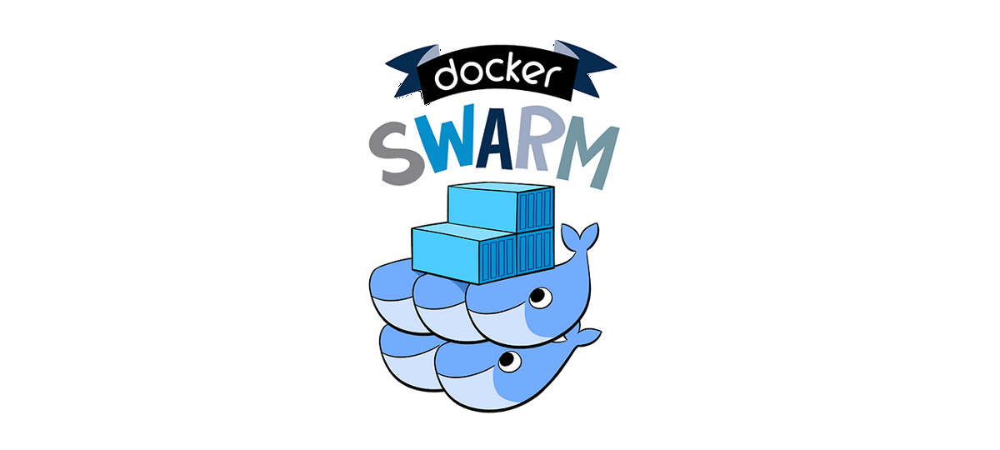

# 3. 도커 스웜

## 3.1. 도커 스웜을 사용하는 이유
- 도커를 사용하다가 서버의 성능이 딸리면 어떻게 할까?
	1. 더 좋은 성능의 서버를 산다 (scale up)
	2. 더 많은 서버를 산다 (scale out)
- Scale out의 어려움: 서비스 디스커버리, 스케줄러, 로드밸런서, 고가용성 등등...
	- 이를 해결해주는 솔루션이 도커 스웜
## 3.2. 스웜 클래식과 도커 스웜 모드
|  | 스웜 (레거시) | 도커 스웜 모드 |
|--|--|--|
| 추가된 버전 | 1.6 | 1.12 |
| 목적 | 여러 대의 도커 서버에 대한 단일 접근점 제공 | MSA를 위한 클러스터링 |
| 기능 | 일반 컨테이너와 똑같음 | 오토스케일링, 로드밸런싱 자체 지원 |
| 클러스터 툴 (분산 코디네이터, 에이전트 등) | 별도 툴로 실행되어야 함 | 내장됨 |

## 3.3. 스웜 모드
### 3.3.1. 구조

- 매니저 노드와 워커 노드로 구성됨
- 매니저 노드는 기본적으로 워커 노드도 겸함
- 워커 노드는 없어도 되지만 매니저 노드는 최소 1개가 있어야 함.
- 보통 매니저 노드를 여러 개 두어 부하를 분산하고 고가용성을 보장함.
- 매니저 노드 갯수는 홀수 개로 구성함. 왜냐? 네트워크 파티셔닝이 발생했을 때 운영 중단을 방지하기 위해
	- 도커 스웜 모드에서 사용하는 Raft Consensus를 참고: http://thesecretlivesofdata.com/raft/
### 3.3.2. 클러스터 구축
- 실습으로 대체
### 3.3.3. 서비스
- 스웜 모드에서의 제어 단위는 컨테이너가 아닌 서비스.
- 서비스란 일종의 컨테이너 집합이며, 서비스를 제어하면 이 집합 내 모든 컨테이너들에 같은 명령이 수행됨.
- 각 컨테이너들은 워커 노드와 매니저 노드에 할당되며 이러한 컨테이너들을 태스크라고 부름.
- 컨테이너와 노드는 1:1 대응이 아님; 상황에 따라 한 노드에 두 개 이상의 컨테이너가 있을 수도 있고 아예 없을 수도 있음.
#### 3.3.3.1. 장애 복구
- 특정 컨테이너가 다운될 경우: 미리 설정된 레플리카 수를 맞추기 위해 새로운 컨테이너를 생성한다.
- 특정 노드가 다운될 경우: 다른 노드에서 컨테이너를 생성한다. 노드가 정상화되어도 컨테이너가 다시 그 노드에서 생성되지는 않는다.
#### 3.3.3.2. secret과 config
- 스웜 모드에서는 `secret`과 `config` 기능을 통해 컨테이너에 비밀값이나 설정값을 전달할 수 있다.
#### 3.3.3.3. 네트워크
- 스웜 모드에서는 `ingress`와 `docker_gwbridge`라는 네트워크가 자동으로 만들어진다.
- `ingress` 네트워크는 스웜 모드에서 기본으로 사용하는 오버레이 네트워크이다. 서비스로의 요청에 대한 로드밸런싱을 담당한다.
	- 오버레이 네트워크: 도커 네트워크 드라이버 중 하나로 서로 다른 도커 데몬 간의 통신에 사용된다.
- `docker_gwbridge` 네트워크는 스웜 모드에서 기본으로 사용하는 브릿지 네트워크이다. 오버레이 네트워크와 각 도커 데몬의 물리적 네트워크 간의 통신에 사용된다.
- `ingress` 네트워크 외에도 사용자 정의 오버레이 네트워크를 만들어 사용할 수 있다.
### 3.4. 노드 다루기
- 실습으로 대체